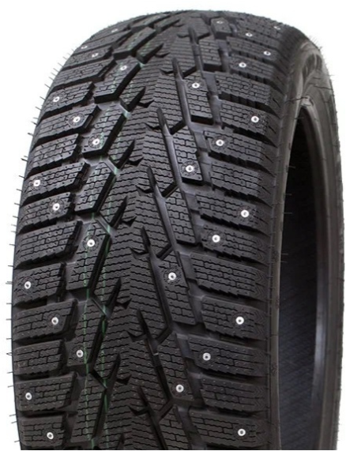
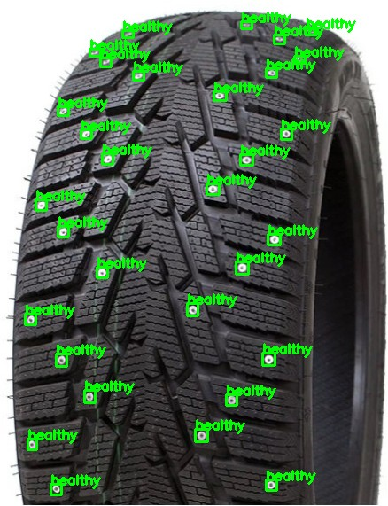

# Spike Detector (FastAPI + Streamlit, Docker Compose)

Detect thread spikes in images using a FastAPI backend (ONNX Runtime) and a Streamlit frontend. Everything runs via Docker Compose. The ONNX model is mounted into the backend container at startup.

## Project layout

```
pmldl-assignment1/
    assets/                # demo assets (input/output images, video)
    code/
        datasets/          # contains script for downloading the dataset
        deployment/
            api/           # FastAPI backend (serves detection)
            app/           # Streamlit frontend (uploads image, shows results)
            docker-compose.yaml
        models/            # contains script for training the model
    data/                  # contains script for downloading the dataset
    models/                # spike_detector.onnx lives here (host)

```

Backend expects the model at `onnx/spike_detector.onnx` inside the container; compose binds `../../models` (host) to `/app/onnx` (container), so `models/spike_detector.onnx` on the host becomes `/app/onnx/spike_detector.onnx` in the container.

## Prerequisites

- Docker and Docker Compose
- macOS/Linux/Windows (tested with CPU, ONNX Runtime CPU)

## Quick start

From the deployment directory:

```bash
cd code/deployment
docker compose up --build
```

Services:
- Frontend (Streamlit): `http://localhost:8501`
- Backend (FastAPI over Gunicorn/Uvicorn): `http://localhost:8000`
  - Interactive docs: `http://localhost:8000/docs`

Ensure your model file exists at:
```
models/spike_detector.onnx
```

## Using the app (Streamlit)

1. Open `http://localhost:8501`.
2. Upload an image (`.png`, `.jpg`, `.jpeg`).
3. Click “Analyze”.
4. The app displays the annotated image and JSON with detected spikes.

## API reference (Backend)

- POST `/api/v1/bin/detect_spikes` (multipart/form-data)
  - field: `image` (file)
  - response: `{ "success": 1|0, "spikes": [ {"box": [x,y,w,h], "class": 0|1}, ... ], "image": "<base64_png>" }`

Example request:

```bash
curl -X POST \
  -F "image=@assets/input.png" \
  http://localhost:8000/api/v1/bin/detect_spikes | jq
```

- POST `/api/v1/detect_spikes` (JSON, base64)

```bash
python - << 'PY'
import base64, json, requests
with open('assets/input.png', 'rb') as f:
    b64 = base64.b64encode(f.read()).decode('utf-8')
resp = requests.post('http://localhost:8000/api/v1/detect_spikes', json={'image': b64})
print(json.dumps(resp.json(), indent=2))
PY
```

## Demo

### Before → After

| Input | Output |
| --- | --- |
|  |  |

### Video walkthrough


